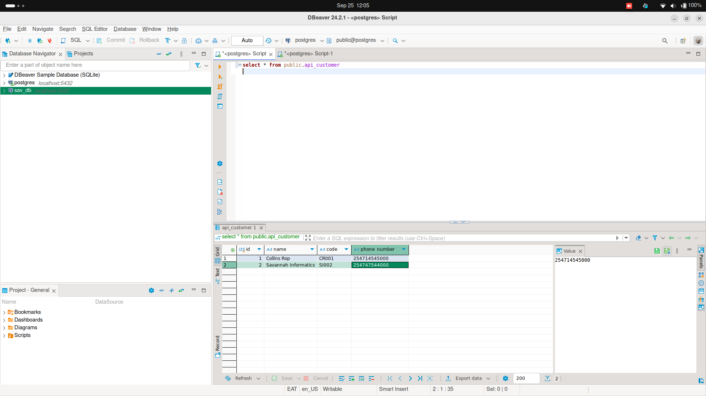
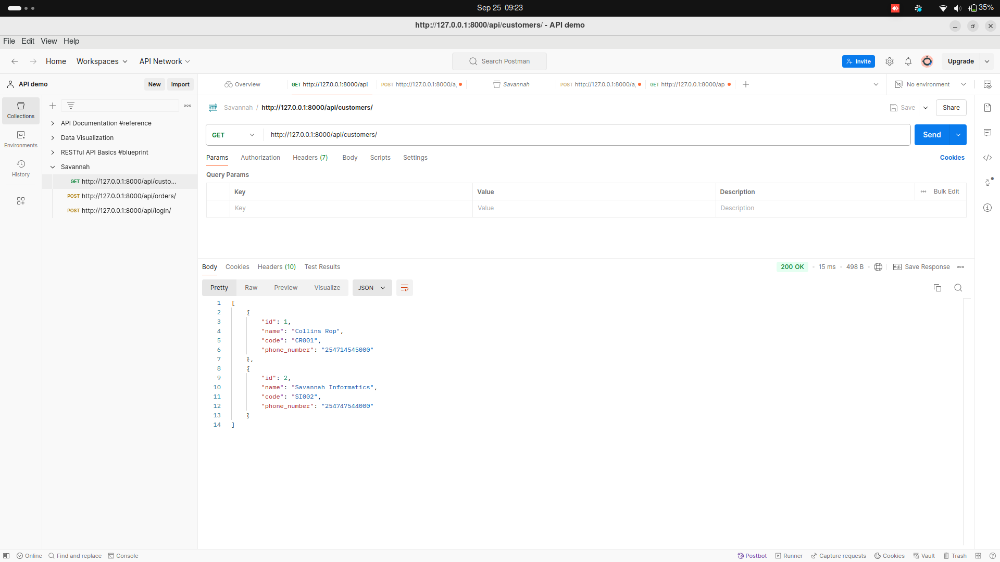
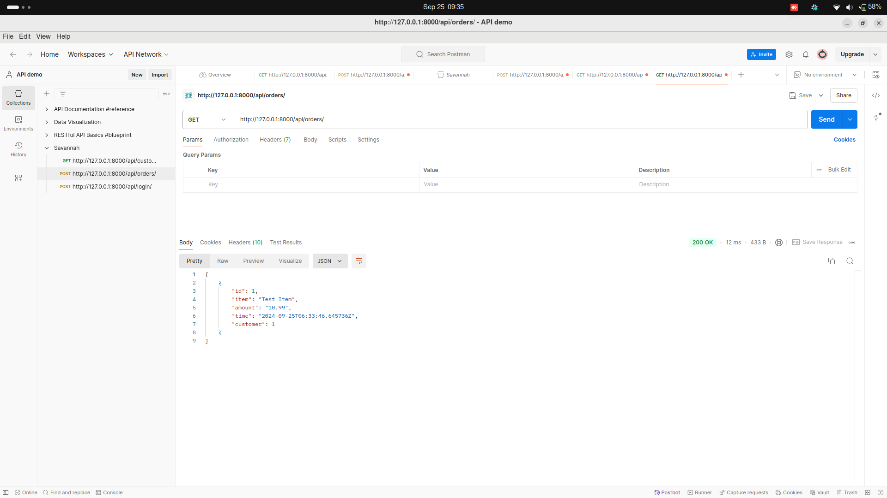
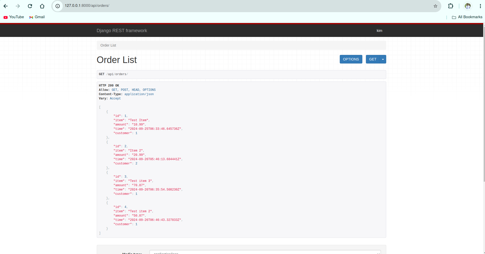
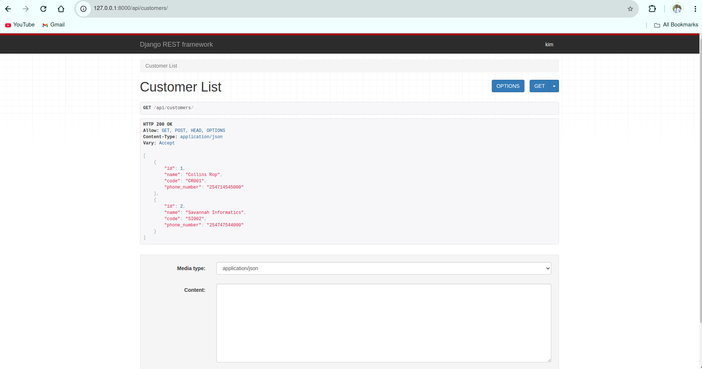
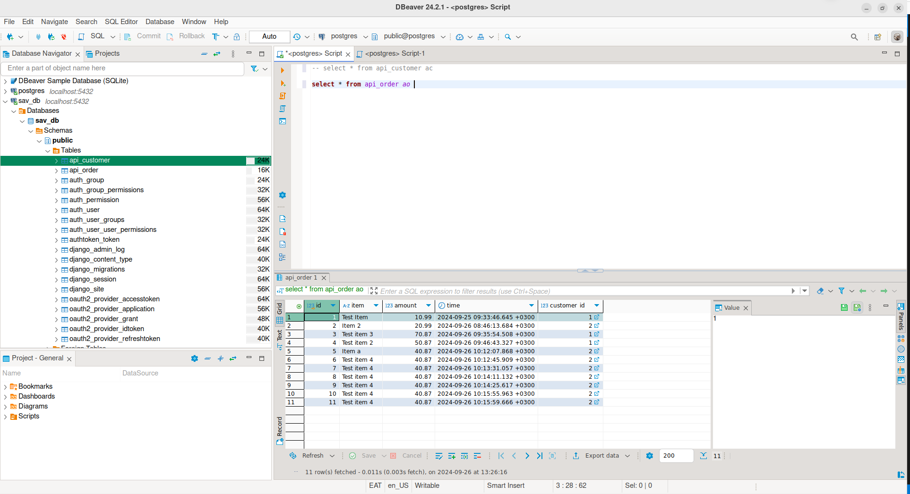

# Customer Order Service

This is a Python-based service that provides a REST API for managing customers and orders. It includes authentication via OpenID Connect and sends SMS notifications when new orders are created.

## Features

- **REST API**: Provides endpoints for managing customers and orders.
- **Authentication and Authorization**: Uses OpenID Connect for secure authentication.
- **SMS Notifications**: Sends SMS notifications for new orders using Africa's Talking SMS gateway.
- **Automated Tests**: Includes automated tests with coverage checking.
- **CI/CD Pipeline**: Configured with GitHub Actions for continuous integration and deployment.

## Setup

### Prerequisites

- Python 3.8+
- PostgreSQL
- Virtualenv

### Installation

1. **Clone the repository:**

    ```sh
    git clone https://github.com/Collins-Rop/savannah-informatics-assessment.git
    cd savannah-informatics-assessment
    ```

2. **Create a virtual environment and install dependencies:**

    ```sh
    python3 -m venv venv
    source venv/bin/activate
    pip install -r requirements.txt
    ```

3. **Set up the database:**

    ```sh
    psql -c "CREATE DATABASE customer_order_service;"
    psql -c "CREATE USER your_username WITH PASSWORD 'your_password';"
    psql -c "ALTER ROLE your_username SET client_encoding TO 'utf8';"
    psql -c "ALTER ROLE your_username SET default_transaction_isolation TO 'read committed';"
    psql -c "ALTER ROLE your_username SET timezone TO 'UTC';"
    psql -c "GRANT ALL PRIVILEGES ON DATABASE customer_order_service TO your_username;"
    \q 
    ```

4. **Configure environment variables:**

    Create a `.env` file in the root directory and add the following:

    ```properties
    # Database configuration
    DB_HOST=localhost
    DB_PORT=5432
    DB_USER=your_username
    DB_PASS=your_password
    DB_NAME=sav_db


    # Application settings
    APP_ENV=development
    APP_DEBUG=true
    APP_SECRET=secret_key

    # API keys
    API_KEY=api_key
    API_SECRET=api_secret

    # Africa's Talking credentials
    AFRICASTALKING_USERNAME=africastalking_username
    AFRICASTALKING_API_KEY=africastalking_api_key
    ```

5. **Apply migrations:**
    ```sh
    python manage.py makemigrations
    ```
    ```sh
    python manage.py migrate
    ```

6. **Create a superuser:**

    ```sh
    python manage.py createsuperuser
    ```

7. **Run the development server:**

    ```sh
    python manage.py runserver
    ```

## API Endpoints

- **List Customers:** `GET /api/customers/`

- **List Orders:** `GET /api/orders/`

## Running Tests

To run tests and check coverage, use the following command:

```sh
pytest --cov=api
```

## Screenshots



